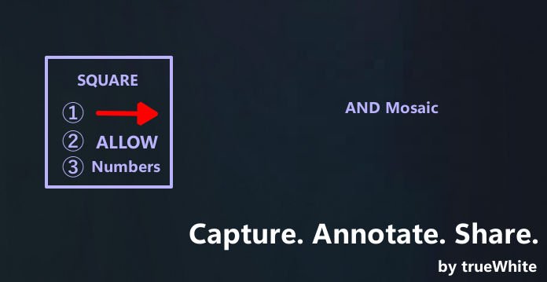

<p align="center">
  
</p>

<h1 align="center">Capsha</h1>

<p align="center">
  <strong>Capture. Annotate. Share.</strong>
</p>

<p align="center">
  Clipboard-first screenshot annotation for Windows.
</p>

<p align="center">
  <a href="https://ko-fi.com/truewhite">
    
  </a>
</p>

<p align="center">
  
  
  
  
</p>

---

## 📸 Screenshot

<p align="center">
  
</p>

---

## ✨ Overview

Capsha is a lightweight screenshot annotation tool built for people who share screenshots every day.

Instead of focusing on editing, Capsha focuses on **speed**.

From capture to clipboard, annotation, saving, and sharing, every interaction is designed to minimize clicks.

---

## 🚀 Features

- ⚡ Instant region capture
- ✏️ Text annotations
- ▭ Rectangle annotations
- ➜ Arrow annotations
- 🟪 Mosaic / Blur
- 📋 Clipboard-first workflow
- 💾 PNG export
- 𝕏 Open X compose page
- 🌐 Japanese / English UI
- 🖥 Multi-monitor support
- 🎨 Modern Windows UI

---

## 💡 Philosophy

Most screenshot tools are built to edit images.

Capsha is built to **share them.**

> Reduce the time between capturing a screenshot and sharing it.

---

## 📦 Installation

Download the latest release from GitHub Releases.

https://github.com/hakujolno/capsha/releases

Extract the ZIP and launch:

```text
Capsha.exe
```

No installation required.

---

## ⌨️ Keyboard Shortcuts

| Shortcut | Action |
|----------|--------|
| Esc | Exit |
| Ctrl + Z | Undo |
| Ctrl + Y | Redo |
| Ctrl + C | Copy |
| Ctrl + S | Save |
| Ctrl + Shift + S | Save As |

---

## 🛠️ Building

```bash
git clone https://github.com/hakujolno/capsha.git
cd capsha

python -m venv .venv
pip install -r requirements.txt

python main.py
```

---

## 🔨 Build Executable

```powershell
scripts/build_release.ps1
```

or

```bash
pyinstaller capsha.spec
```

---

## 🗺️ Roadmap

- [x] Clipboard-first workflow
- [x] Fast annotation
- [x] Multi-language support(en, jp)
- [ ] Automatic updates
- [ ] macOS support
- [ ] OCR
- and more...
---

## 🤝 Contributing

Issues, Pull Requests, feature requests, and feedback are always welcome.

---

## ❤️ Support

Capsha is developed and maintained in my spare time.

If Capsha helps you save time, consider supporting its development.

Your support helps fund new features, bug fixes, and future releases.

<a href="https://ko-fi.com/truewhite">
  
</a>

---

## 📄 License

MIT License

---

<p align="center">
Made with ❤️ by <strong>trueWhite</strong>
</p>
